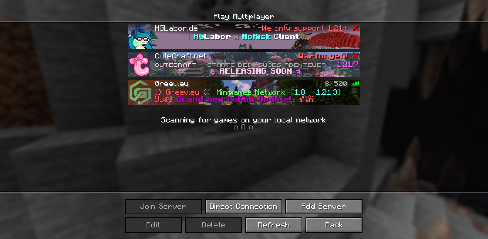

# nrc-server-mappings

This repository provides server mappings for the NoRisk Client, allowing servers to have enhanced icons, banners, and metadata displayed in the client.

## What is this?
- Supplies the NoRisk Client  with improved server presentation: custom icons, banners, and descriptive metadata.
- Ensures all server assets (icons, backgrounds) follow consistent conventions for best appearance in the client.
- Contains scripts to validate and merge server manifests into a single distributable format for the client to consume.

## Structure
- `servers/` — Individual server manifests and images for each server.
- `merged/` — Output directory for merged manifests and assets (generated by scripts, used by the client).
- `scripts/` — Validation and merge scripts.
- `docs/` — Documentation for manifest and image conventions.

## Documentation
- [Manifest conventions](docs/manifest.md)
- [Image conventions](docs/conventions.md)

## Local Testing
- Run `npm install` to install dependencies.
- Use `npm run merge` to validate and merge all server manifests for the client.

---
For more details, see the documentation in the `docs/` directory.

## Ingame looks

